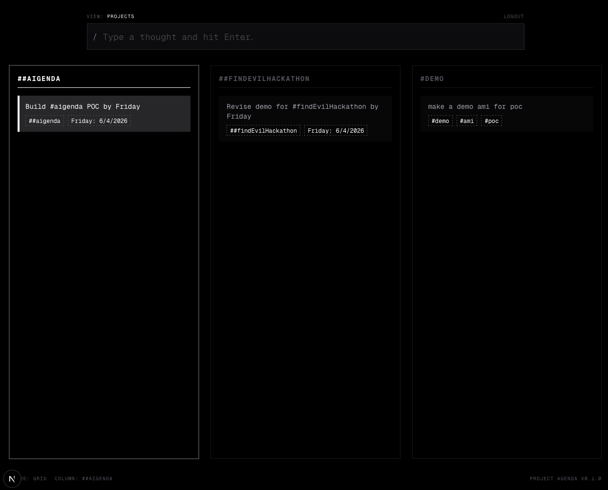

# AIgenda
A tribute to the late 90s personal information manager `agenda` from [Lotus](https://en.wikipedia.org/wiki/Lotus_Agenda).

I used it extensively until DOS went the way of the GUI and loved the ability to just type stuff and have it figure out how it related to people, projects, times, etc. 

Of course it is 2026 so this revision uses AI to process incoming items. 

Front end is Next.js/react/tailwind.
Back end is GCP: Cloud run/functions, firebase

## Screenshot



## Getting Started
### Firebase
TBD

### To deploy the functions to firebase: 
npx firebase deploy --only functions --non-interactive

### Local web
Run the development server:

```bash
npm run dev
# or
yarn dev
# or
pnpm dev
# or
bun dev
```

Open [http://localhost:3000](http://localhost:3000) with your browser to see the result.

You can start editing the page by modifying `app/page.tsx`. The page auto-updates as you edit the file.
This is a [Next.js](https://nextjs.org) project bootstrapped with [`create-next-app`](https://nextjs.org/docs/app/api-reference/cli/create-next-app).

